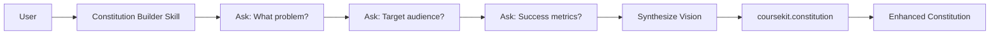
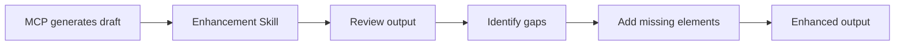
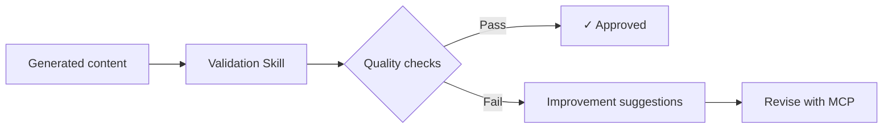

# CourseKit Skills + MCP Integration Architecture

## Overview
This document outlines how to enhance the CourseKit MCP server with intelligent Claude skills that guide users through better course development.

## Architecture Patterns

### Pattern 1: Pre-Processing Skills (Information Gathering)
Skills that collect detailed information BEFORE calling MCP tools.



### Pattern 2: Enhancement Skills (Output Refinement)
Skills that take MCP output and improve it.



### Pattern 3: Validation Skills (Quality Assurance)
Skills that verify outputs meet quality standards.



## Implementation Strategy

### Phase 1: Constitution Builder Skill (Current)
**Goal**: Improve constitution quality through guided questioning

**Implementation**:
```python
class ConstitutionBuilderSkill:
    def __init__(self):
        self.questions = {
            'vision': [
                "What problem does this course solve?",
                "What transformation will learners experience?",
                "What makes this unique?"
            ],
            'audience': [
                "What is their current skill level?",
                "What are their constraints?",
                "What tools do they have?"
            ],
            'outcomes': [
                "What specific skills will they gain?",
                "How will they prove mastery?",
                "How does this apply to their work?"
            ]
        }
    
    async def gather_information(self):
        responses = {}
        for category, questions in self.questions.items():
            responses[category] = await self.ask_questions(questions)
        return responses
    
    async def synthesize_vision(self, responses):
        # Create comprehensive vision from all responses
        vision = f"""
        Create a {responses['format']} that solves {responses['problem']} 
        for {responses['audience']} by teaching {responses['skills']}.
        Success means {responses['success_metric']}.
        """
        return vision
    
    async def generate_constitution(self, vision):
        # Call MCP tool with enriched vision
        result = await mcp.call('coursekit.constitution', {
            'vision': vision
        })
        return result
```

### Phase 2: Specification Refiner Skill
**Goal**: Ensure learning outcomes follow best practices

**Key Features**:
- Validates outcomes use Bloom's taxonomy action verbs
- Ensures outcomes are measurable
- Checks alignment with constitution
- Suggests missing outcomes

**Interaction Flow**:
```javascript
// User provides basic description
"Create a workshop on Python data analysis"

// Skill enhances this:
1. Reviews constitution for context
2. Asks: "What specific data analysis skills?"
3. Asks: "What datasets will they work with?"
4. Asks: "What's the final project?"
5. Generates comprehensive specification
6. Validates each outcome is SMART
7. Calls coursekit.specify with enriched input
```

### Phase 3: Interactive Plan Builder Skill
**Goal**: Create realistic, well-paced course plans

**Key Features**:
- Time estimation validator
- Energy curve optimizer
- Activity variety checker
- Break scheduler

**Example Enhancement**:
```javascript
// Basic MCP call:
mcp.call('coursekit.plan', {
  format: 'workshop',
  duration: '4 hours'
})

// Skill-enhanced version:
skill.buildPlan({
  format: 'workshop',
  duration: '4 hours',
  // Skill adds:
  energyCurve: 'high-low-high-moderate',
  activityRatio: '20% lecture, 60% hands-on, 20% discussion',
  breakStrategy: 'every 50 minutes',
  groupSize: 20,
  roomSetup: 'pods of 4',
  techChecks: 'built into schedule'
})
```

### Phase 4: Smart Task Generator Skill
**Goal**: Generate comprehensive, prioritized task lists

**Enhancements**:
- Dependency mapping
- Time estimation
- Resource requirements
- Parallel work identification
- Critical path analysis

### Phase 5: Content Creation Coach Skill
**Goal**: Guide high-quality content creation

**Features**:
- Template suggestions
- Example provision
- Style guide enforcement
- Accessibility checking

## Skill-MCP Communication Patterns

### Pattern A: Serial Enhancement
```javascript
async function createCourseWithSkills(topic) {
  // Step 1: Skill gathers information
  const requirements = await constitutionSkill.gatherRequirements(topic);
  
  // Step 2: MCP generates constitution
  const constitution = await mcp.call('coursekit.constitution', {
    vision: requirements.synthesizedVision
  });
  
  // Step 3: Skill validates and enhances
  const enhanced = await constitutionSkill.enhance(constitution);
  
  // Step 4: Continue to next phase
  const spec = await specificationSkill.build(enhanced);
  
  // Continue through all phases...
}
```

### Pattern B: Parallel Processing
```javascript
async function fastTrackCourse(requirements) {
  // Skills prepare all inputs simultaneously
  const [visionData, specData, planData] = await Promise.all([
    constitutionSkill.prepare(requirements),
    specificationSkill.prepare(requirements),
    planSkill.prepare(requirements)
  ]);
  
  // MCP processes in sequence with enriched inputs
  const constitution = await mcp.call('coursekit.constitution', visionData);
  const spec = await mcp.call('coursekit.specify', specData);
  const plan = await mcp.call('coursekit.plan', planData);
  
  return { constitution, spec, plan };
}
```

### Pattern C: Iterative Refinement
```javascript
async function refineWithFeedback(draft) {
  let quality = 0;
  let content = draft;
  
  while (quality < 0.8) {
    // Skill analyzes current version
    const analysis = await validationSkill.analyze(content);
    quality = analysis.score;
    
    if (quality < 0.8) {
      // Get specific improvements
      const improvements = await validationSkill.suggest(analysis);
      
      // MCP regenerates with guidance
      content = await mcp.call('coursekit.implement', {
        task: content.task,
        guidance: improvements
      });
    }
  }
  
  return content;
}
```

## Practical Implementation Steps

### Step 1: Create Base Skills (Week 1)
```bash
coursekit-skills/
├── constitution-builder/
│   ├── SKILL.md
│   ├── questions.json
│   └── templates.json
├── specification-refiner/
│   ├── SKILL.md
│   └── bloom-taxonomy.json
└── plan-optimizer/
    ├── SKILL.md
    └── time-patterns.json
```

### Step 2: Add Skill Loader to MCP (Week 2)
```javascript
// In MCP server
class SkillIntegration {
  async loadSkill(skillName) {
    const skillPath = `./skills/${skillName}/SKILL.md`;
    const skill = await fs.readFile(skillPath, 'utf-8');
    return skill;
  }
  
  async enhanceWithSkill(tool, input, skillName) {
    const skill = await this.loadSkill(skillName);
    // Process input through skill logic
    const enhanced = await this.processWithSkill(input, skill);
    // Call original MCP tool with enhanced input
    return await this.mcp.call(tool, enhanced);
  }
}
```

### Step 3: Create Skill Orchestrator (Week 3)
```javascript
class CourseKitOrchestrator {
  async createCourse(topic, options = {}) {
    const results = {};
    
    // Phase 1: Constitution with skill
    if (options.guided) {
      results.constitution = await this.guidedConstitution(topic);
    } else {
      results.constitution = await this.quickConstitution(topic);
    }
    
    // Phase 2-5: Continue through workflow
    // Each phase can use skills or direct MCP
    
    return results;
  }
}
```

## Benefits of Skill Integration

### For Users
1. **Better Output Quality**: Skills ensure comprehensive inputs
2. **Learning Experience**: Users learn what makes good course design
3. **Flexibility**: Can use skills, MCP, or both
4. **Time Savings**: Get it right the first time

### For the System
1. **Modular Enhancement**: Add capabilities without changing MCP
2. **Testable Components**: Skills can be tested independently
3. **Reusable Knowledge**: Skills accumulate best practices
4. **Progressive Enhancement**: Start simple, add sophistication

## Example: Complete Workflow with Skills

```javascript
// User says: "I need a Python data science workshop"

// 1. Constitution Builder Skill activates
"Let's build a strong foundation. First, tell me:
What specific problem are data scientists facing that this solves?"

// User: "They can't translate business requirements into code"

// 2. Skill continues gathering...
// 3. Creates enriched vision
// 4. Calls MCP with comprehensive input
// 5. Result: High-quality constitution

// 6. Specification Refiner Skill activates
"Based on your constitution, I'll help create SMART learning outcomes.
For translating business requirements, what specific techniques should they master?"

// Continue through all phases with skill enhancement...

// Final result: Complete, high-quality course materials
```

## Next Steps

1. **Implement Constitution Builder Skill** (Done ✓)
2. **Test with MCP integration**
3. **Create Specification Refiner Skill**
4. **Build simple orchestrator**
5. **Add validation skills**
6. **Create skill templates**
7. **Document skill creation guide**

This architecture allows skills and MCP to work together synergistically, with skills providing intelligence and guidance while MCP provides the core workflow engine.
