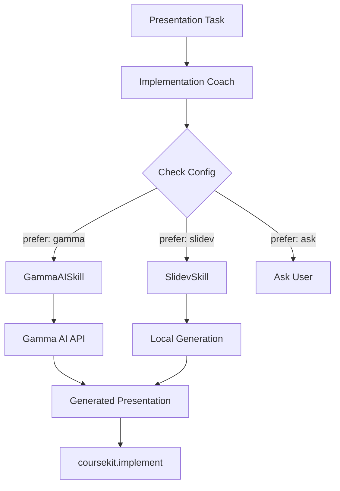

# Gamma AI Integration for CourseKit

## Architecture Overview

Gamma AI becomes a content generation provider option alongside Slidev and PowerPoint, selected through configuration or runtime choice.



## Configuration Architecture

### 1. Config File Location Structure
```
coursekit/
├── .env                      # API keys (git-ignored)
├── config/
│   ├── default.json         # Default settings
│   ├── providers.json       # Provider configurations
│   └── user-preferences.json # User overrides
├── mcp-server/
├── registry/                 # Provider implementations
│   ├── BaseContentSkill.js
│   ├── GammaAISkill.js
│   ├── ImplementationCoachSkill.js
│   └── ProviderRegistry.js
├── .claude/skills/          # Claude Code skills (conversation guides)
│   └── content-skills/
│       ├── slidev-skill/
│       └── powerpoint-skill/
└── .coursekit/              # Generated content
```

### 2. Environment Variables (.env)
```bash
# API Keys - NEVER commit this file
GAMMA_AI_API_KEY=your_gamma_api_key_here
OPENAI_API_KEY=your_openai_key_if_needed
ANTHROPIC_API_KEY=your_claude_key_if_needed

# Provider Preferences
DEFAULT_PRESENTATION_PROVIDER=gamma
DEFAULT_DOCUMENT_PROVIDER=docx
DEFAULT_EXERCISE_PROVIDER=markdown
```

### 3. Provider Configuration (config/providers.json)
```json
{
  "providers": {
    "presentations": {
      "gamma": {
        "enabled": true,
        "priority": 1,
        "api": {
          "endpoint": "https://api.gamma.app/v1",
          "timeout": 60000
        },
        "capabilities": [
          "ai-generation",
          "templates",
          "themes",
          "export-pdf",
          "export-pptx"
        ],
        "preferences": {
          "style": "professional",
          "length": "auto",
          "includeImages": true
        }
      },
      "slidev": {
        "enabled": true,
        "priority": 2,
        "capabilities": [
          "markdown",
          "code-highlighting",
          "speaker-notes",
          "export-pdf"
        ]
      },
      "powerpoint": {
        "enabled": true,
        "priority": 3,
        "requires": ["pptxgenjs"],
        "capabilities": [
          "templates",
          "animations",
          "charts"
        ]
      }
    },
    "documents": {
      "markdown": { "enabled": true, "priority": 1 },
      "docx": { "enabled": true, "priority": 2 }
    }
  },
  "selection": {
    "mode": "auto",  // auto | manual | config
    "rules": {
      "presentations": {
        "withCode": "slidev",
        "withBranding": "powerpoint",
        "withAI": "gamma",
        "default": "gamma"
      }
    }
  }
}
```

### 4. User Preferences (config/user-preferences.json)
```json
{
  "preferredProviders": {
    "presentations": "gamma",
    "exercises": "markdown",
    "documents": "docx"
  },
  "gammaSettings": {
    "autoGenerate": true,
    "reviewBeforeAccept": true,
    "preferredTheme": "professional-blue",
    "targetAudience": "technical"
  },
  "alwaysAsk": false
}
```

## Implementation Prompts for Claude

### Prompt 1: Create Gamma AI Skill
```
Create a GammaAISkill class for the CourseKit system that integrates with Gamma AI's API for presentation generation.

Requirements:
1. Extends the BaseContentSkill class
2. Implements methods: gatherRequirements(), generateContent(), exportContent()
3. Uses the Gamma AI API (https://api.gamma.app/v1) with proper authentication
4. Handles API key from environment variable GAMMA_AI_API_KEY
5. Supports both AI generation and template-based creation
6. Implements retry logic for API failures
7. Maps CourseKit context (constitution, specification, plan) to Gamma AI parameters

The skill should:
- Convert course module content into Gamma presentation structure
- Use appropriate themes based on audience
- Include speaker notes from facilitator guides
- Handle images and diagrams
- Support export to multiple formats (PDF, PPTX)

Include error handling for:
- Missing API key
- API rate limits
- Network failures
- Invalid responses
```

### Prompt 2: Create Configuration Manager
```
Create a ConfigurationManager class for CourseKit that handles provider selection and preferences.

Requirements:
1. Load configuration from multiple sources (env, default.json, providers.json, user-preferences.json)
2. Merge configurations with proper precedence: user > env > providers > default
3. Provide methods: getProvider(contentType), getProviderConfig(provider), setPreference(key, value)
4. Support dynamic provider selection based on task characteristics
5. Cache configuration for performance
6. Watch for config file changes in development mode

The manager should handle:
- Secure API key retrieval from environment
- Provider capability checking
- Fallback provider selection if primary fails
- Configuration validation
- Runtime provider switching

Include a method selectProvider(task, context) that:
1. Checks task requirements
2. Matches against provider capabilities
3. Considers user preferences
4. Returns selected provider or asks user if configured
```

### Prompt 3: Enhance Implementation Coach for Provider Routing
```
Modify the ImplementationCoachSkill to support multiple content providers with dynamic selection.

Current architecture has Implementation Coach routing to content skills. Enhance it to:

1. Load ConfigurationManager on initialization
2. Check configuration for preferred provider
3. Route to appropriate skill (GammaAI, Slidev, PowerPoint, etc.)
4. Handle provider-specific requirements gathering
5. Manage fallback if primary provider fails

Add these methods:
- selectContentProvider(task, context): Determines which provider to use
- initializeProvider(provider, config): Sets up selected provider with config
- executeWithFallback(provider, task, context): Tries primary, falls back if needed
- compareProviders(task): Shows user provider options with capabilities

Integration points:
- Before: Implementation Coach identifies content type
- New: Check config and select provider
- After: Route to selected provider skill

Handle these scenarios:
1. User explicitly requests a provider
2. Config specifies default provider
3. Task characteristics determine best provider
4. Provider is unavailable (fallback needed)
5. User wants to compare options
```

### Prompt 4: Create Gamma AI API Integration
```
Create a GammaAPIClient class that handles all communication with Gamma AI's API.

Using the Gamma AI API documentation at https://developers.gamma.app/docs/, implement:

1. Authentication using Bearer token from GAMMA_AI_API_KEY
2. Methods for main endpoints:
   - createPresentation(params): POST /v1/presentations
   - getPresentation(id): GET /v1/presentations/{id}
   - updatePresentation(id, params): PUT /v1/presentations/{id}
   - exportPresentation(id, format): GET /v1/presentations/{id}/export
   - listTemplates(): GET /v1/templates
   - generateWithAI(prompt, context): POST /v1/ai/generate

3. Request formatting:
   - Convert CourseKit module content to Gamma format
   - Map learning objectives to slide content
   - Include speaker notes as presenter notes
   - Handle code blocks and technical content

4. Response handling:
   - Parse Gamma presentation structure
   - Extract slide content and notes
   - Handle async generation (polling for completion)
   - Download exported files

5. Error handling and retries:
   - Exponential backoff for rate limits
   - Retry with jitter for network failures
   - Graceful degradation for partial failures

Include helpers for:
- Prompt construction from course context
- Theme selection based on audience
- Content chunking for API limits
- Progress tracking for long operations
```

### Prompt 5: Create Provider Comparison Tool
```
Create a ProviderComparisonTool that helps users choose between content providers.

The tool should:

1. Analyze task requirements:
   - Content type (slides, docs, exercises)
   - Technical complexity (code heavy, visual, text)
   - Audience (technical, business, mixed)
   - Time constraints
   - Export needs

2. Compare available providers:
   - List capabilities of each provider
   - Show pros/cons for the specific task
   - Estimate generation time
   - Display cost if applicable
   - Show example outputs if available

3. Generate comparison matrix:
   ```
   For task: "Create Module 1 slides on Python basics"
   
   | Provider | Strengths | Weaknesses | Time | Cost |
   |----------|-----------|------------|------|------|
   | Gamma AI | AI-powered, Professional themes, Quick | Less code control | 2 min | Free/Paid |
   | Slidev | Code highlighting, Version control, Free | Manual design | 15 min | Free |
   | PowerPoint | Familiar, Animations, Templates | Manual creation | 30 min | License |
   ```

4. Make recommendation:
   - Score each provider for the task
   - Recommend best option
   - Allow user override

5. Remember choices:
   - Track user selections
   - Learn preferences over time
   - Update user-preferences.json

Include interactive mode where it asks:
- "What's most important: Speed, Quality, or Control?"
- "Will you present this live or share for self-study?"
- "Do you need to embed code examples?"
```

### Prompt 6: Create Integration Test Suite
```
Create comprehensive tests for the Gamma AI integration with CourseKit.

Test scenarios:

1. Configuration Loading:
   - Test config file loading and merging
   - Test environment variable reading
   - Test fallback to defaults
   - Test invalid configuration handling

2. Provider Selection:
   - Test automatic selection based on task
   - Test manual provider override
   - Test fallback when primary fails
   - Test capability matching

3. Gamma AI Integration:
   - Mock Gamma API responses
   - Test successful presentation creation
   - Test API error handling
   - Test retry logic
   - Test export functionality

4. End-to-end Workflow:
   - Test: Task → Implementation Coach → Config Check → Gamma AI → Content
   - Test: Fallback from Gamma to Slidev on failure
   - Test: User preference persistence
   - Test: Multiple content types

5. Security:
   - Test API key is never logged
   - Test secure config file handling
   - Test sanitization of API responses

Create test fixtures for:
- Sample task inputs
- Mock Gamma API responses
- Configuration variations
- Error conditions

Include performance tests:
- Measure API response times
- Test caching effectiveness
- Test parallel content generation
```

## Implementation Architecture

### Enhanced Implementation Coach Flow

```javascript
class ImplementationCoachSkill {
  constructor(mcp) {
    super('implementation-coach', mcp);
    this.configManager = new ConfigurationManager();
    this.providers = new Map();
    
    // Load all available providers
    this.loadProviders();
  }
  
  async loadProviders() {
    const config = await this.configManager.getProvidersConfig();
    
    for (const [type, providers] of Object.entries(config.providers)) {
      for (const [name, settings] of Object.entries(providers)) {
        if (settings.enabled) {
          const Provider = await this.loadProviderSkill(name);
          this.providers.set(name, new Provider(settings));
        }
      }
    }
  }
  
  async route(task, context) {
    // 1. Identify content type
    const contentType = this.identifyContentType(task);
    
    // 2. Select provider based on config and task
    const provider = await this.selectProvider(contentType, task, context);
    
    // 3. Initialize provider with config
    await provider.initialize({
      apiKey: process.env[`${provider.name.toUpperCase()}_API_KEY`],
      config: this.configManager.getProviderConfig(provider.name)
    });
    
    // 4. Generate content with selected provider
    try {
      const content = await provider.generateContent(task, context);
      return { success: true, content, provider: provider.name };
    } catch (error) {
      // 5. Fallback to alternative provider
      const fallback = await this.getFallbackProvider(contentType, provider.name);
      const content = await fallback.generateContent(task, context);
      return { success: true, content, provider: fallback.name, fallbackUsed: true };
    }
  }
  
  async selectProvider(contentType, task, context) {
    const mode = this.configManager.get('selection.mode');
    
    if (mode === 'auto') {
      // Use rules to select best provider
      return this.autoSelectProvider(contentType, task);
    } else if (mode === 'manual') {
      // Ask user every time
      return await this.askUserForProvider(contentType);
    } else {
      // Use configured default
      const defaultProvider = this.configManager.get(`preferredProviders.${contentType}`);
      return this.providers.get(defaultProvider);
    }
  }
}
```

### Gamma AI Skill Implementation

```javascript
class GammaAISkill extends BaseContentSkill {
  constructor(config) {
    super('gamma-ai', config);
    this.client = null;
  }
  
  async initialize({ apiKey, config }) {
    this.client = new GammaAPIClient(apiKey, config);
  }
  
  async generateContent(task, context) {
    // Convert CourseKit context to Gamma prompt
    const prompt = this.buildPrompt(task, context);
    
    // Call Gamma AI API
    const presentation = await this.client.generateWithAI(prompt, {
      theme: this.selectTheme(context),
      length: this.estimateSlideCount(task),
      includeImages: true,
      tone: this.determineTone(context)
    });
    
    // Poll for completion
    const completed = await this.waitForCompletion(presentation.id);
    
    // Export in requested format
    const exported = await this.client.exportPresentation(
      completed.id, 
      'pptx'
    );
    
    return {
      content: exported,
      metadata: completed,
      provider: 'gamma-ai'
    };
  }
  
  buildPrompt(task, context) {
    return `
Create a presentation for: ${task.description}

Context:
- Course: ${context.constitution.title}
- Module: ${task.module}
- Audience: ${context.constitution.audience}
- Learning Objectives: ${context.specification.outcomes}

Requirements:
- Professional design
- Include speaker notes
- ${task.duration} minutes of content
- Focus on: ${task.focus}
    `;
  }
}
```

## Benefits of This Architecture

1. **Flexibility**: Switch providers based on needs
2. **Scalability**: Easy to add new providers
3. **Resilience**: Fallback options if primary fails
4. **Configuration**: Centralized settings management
5. **Security**: API keys in environment, not code
6. **User Control**: Can override automatic selection

## Next Steps

1. Use these prompts with Claude to implement each component
2. Start with ConfigurationManager (foundation)
3. Create GammaAISkill
4. Enhance Implementation Coach
5. Add comparison tool
6. Test integration

This architecture maintains the extensibility of your system while adding powerful AI content generation!