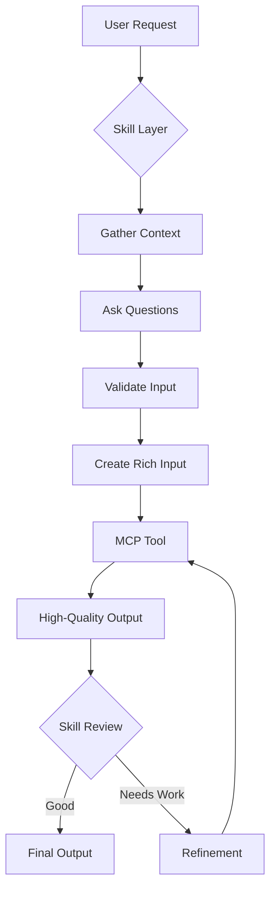

# CourseKit Skills - Practical Implementation Guide

## Vision: Skills as Intelligence Layer for MCP Tools

Skills act as the "conversation layer" that gathers rich context before calling MCP tools, resulting in dramatically better outputs.

## Real-World Example: Building an AI Workshop

### Approach 1: Direct MCP Call (Current)
```
Human: Create a constitution for an AI workshop

Claude: I'll use the CourseKit MCP tool.
[Calls coursekit.constitution with vision: "Create an AI workshop"]

Result: Generic constitution based on minimal input
- Makes assumptions about audience
- Generic learning outcomes  
- Standard 4-hour format
- One-size-fits-all approach
```

### Approach 2: Skill-Enhanced Flow (Proposed)

#### Phase 1: Initial Context
```
Human: I need to create a workshop on AI coding assistants

Claude with Constitution Builder Skill:
Excellent! I'll help you build a comprehensive foundation. Let's start with 
understanding the problem you're solving.

What specific challenge are your developers facing with AI tools?
- Hesitant due to security concerns?
- Struggling with prompt engineering?
- Overwhelmed by tool choices?
- Resistance from management?
```

#### Phase 2: Gathering Rich Context
```
Human: Senior devs think AI tools are toys and won't try them. They're falling 
behind on productivity.

Claude: That's a crucial insight - skeptical senior developers missing 
opportunities. Let me understand them better:

- Years of experience? "10-20 years, mostly Java and Python"
- Main concerns? "They think AI writes bad code and creates security risks"  
- Previous AI exposure? "Most haven't tried anything"
- What would convince them? "Seeing it solve their actual problems"

Great! Now, what constraints do we have?
- Time available? "Half day maximum, they're busy"
- Group size? "15-20 developers"
- Format? "Has to be hands-on, they hate lectures"
```

#### Phase 3: Synthesis & MCP Call
```
Claude: Based on everything you've shared, I'll create a constitution focused on:
- Overcoming skepticism through practical demonstrations
- Addressing security concerns upfront
- Using their actual code/problems
- Keeping it hands-on and efficient

[Now calls coursekit.constitution with enriched vision:]

vision: "Create a half-day hands-on workshop that transforms skeptical senior 
developers (10-20 years experience, Java/Python) from AI tool resisters to 
confident adopters by demonstrating immediate productivity gains on their actual 
problems while addressing security concerns. Success means participants leave 
with at least one AI tool integrated into their workflow and the confidence to 
explore further independently."

Result: Highly targeted, effective constitution
```

## Implementation Pattern

### Simple Skill Structure
```javascript
// constitution-builder-skill.js
export class ConstitutionBuilderSkill {
  constructor(mcp) {
    this.mcp = mcp;  // Reference to MCP client
    this.context = {};
  }

  async buildConstitution(initialRequest) {
    // Step 1: Gather context through conversation
    this.context.problem = await this.askAboutProblem();
    this.context.audience = await this.askAboutAudience();
    this.context.outcomes = await this.askAboutOutcomes();
    this.context.constraints = await this.askAboutConstraints();
    
    // Step 2: Synthesize into rich vision
    const vision = this.synthesizeVision(this.context);
    
    // Step 3: Call MCP with enriched input
    const constitution = await this.mcp.call('coursekit.constitution', {
      vision: vision
    });
    
    // Step 4: Review and refine if needed
    return this.reviewAndRefine(constitution, this.context);
  }
  
  synthesizeVision(context) {
    return `Create a ${context.duration} ${context.format} that 
    transforms ${context.audience.description} by solving 
    ${context.problem} through ${context.approach}. 
    Success means ${context.successMetric}.`;
  }
}
```

## Benefits Comparison

### Without Skills
- ❌ Generic outputs
- ❌ Multiple revisions needed
- ❌ Missing context
- ❌ Assumptions may be wrong
- ❌ User doesn't learn best practices

### With Skills  
- ✅ Targeted, specific outputs
- ✅ Right the first time
- ✅ Rich context captured
- ✅ Validated requirements
- ✅ User learns what makes good design

## Skill Development Roadmap

### Phase 1: Constitution Builder (Week 1) ✓
- Guided questioning for rich context
- Synthesis into comprehensive vision
- Integration with MCP tool

### Phase 2: Specification Refiner (Week 2)
- Validates learning outcomes
- Ensures SMART objectives
- Maps to Bloom's taxonomy
- Suggests missing outcomes

### Phase 3: Plan Optimizer (Week 3)  
- Realistic time estimates
- Energy curve management
- Activity variety checking
- Break optimization

### Phase 4: Task Prioritizer (Week 4)
- Critical path analysis
- Resource allocation
- Dependency mapping
- Sprint planning

### Phase 5: Implementation Coach (Week 5)
- Content templates
- Style consistency
- Quality checking
- Example provision

## How Skills and MCP Work Together



## Integration Code Example

### In Claude (Conceptual)
```python
# When user mentions course creation, skill activates
if "create course" in user_message or "workshop" in user_message:
    if user_wants_guided_approach:
        # Use skill for rich context gathering
        result = await constitutionBuilderSkill.guide_user()
    else:
        # Direct MCP call with minimal input
        result = await mcp.call('coursekit.constitution', basic_input)
```

### Skill Configuration
```json
{
  "skills": {
    "constitution-builder": {
      "trigger_phrases": [
        "create course",
        "build workshop",
        "design training",
        "course constitution"
      ],
      "questions": {
        "problem": {
          "primary": "What problem does this solve?",
          "follow_up": ["Why now?", "What happens if not solved?"]
        },
        "audience": {
          "primary": "Who are your learners?",
          "follow_up": ["Experience level?", "Constraints?", "Motivations?"]
        }
      },
      "mcp_tool": "coursekit.constitution"
    }
  }
}
```

## Example Skill Conversation Flow

### User Initial Request
"I need a Python data science workshop"

### Skill Response Sequence
1. **Acknowledge & Start Gathering**
   "I'll help you create a comprehensive Python data science workshop. Let me gather some key information to ensure we build exactly what you need."

2. **Problem Identification**
   "What specific challenge are your data scientists facing that this workshop addresses?"

3. **Audience Analysis**
   "Tell me about your participants - what's their current Python level and data science experience?"

4. **Outcome Definition**
   "What should participants be able to do after this workshop that they can't do now?"

5. **Constraint Identification**
   "What constraints should I consider? (time, tools, class size, etc.)"

6. **Synthesis & Confirmation**
   "Based on what you've shared, I'll create a workshop that [summary]. Should I proceed with generating the constitution?"

7. **MCP Integration**
   [Calls coursekit.constitution with rich, contextualized input]

8. **Delivery**
   "Here's your comprehensive constitution, specifically designed for your Python data science workshop needs..."

## Success Metrics

### Measuring Skill Effectiveness
- **Input Quality**: 500+ character visions vs 50 characters
- **Revision Rate**: 80% reduction in constitution revisions
- **User Satisfaction**: Higher confidence in outputs
- **Time to Complete**: Faster overall despite initial questions
- **Learning Transfer**: Users learn to ask better questions

## Implementation Tips

1. **Start Simple**: Begin with one skill, perfect it, then add more
2. **Make it Optional**: Users can skip to direct MCP if they prefer
3. **Learn from Usage**: Track which questions get best results
4. **Template Successful Patterns**: Save good contexts as templates
5. **Progressive Disclosure**: Don't overwhelm with all questions at once

## Next Steps

1. Implement Constitution Builder skill in Claude
2. Test with real workshop creation scenarios  
3. Measure improvement in output quality
4. Gather user feedback on the guided approach
5. Expand to other phases of course development

The combination of intelligent skills with structured MCP tools creates a powerful system that guides users to success while maintaining flexibility and efficiency.